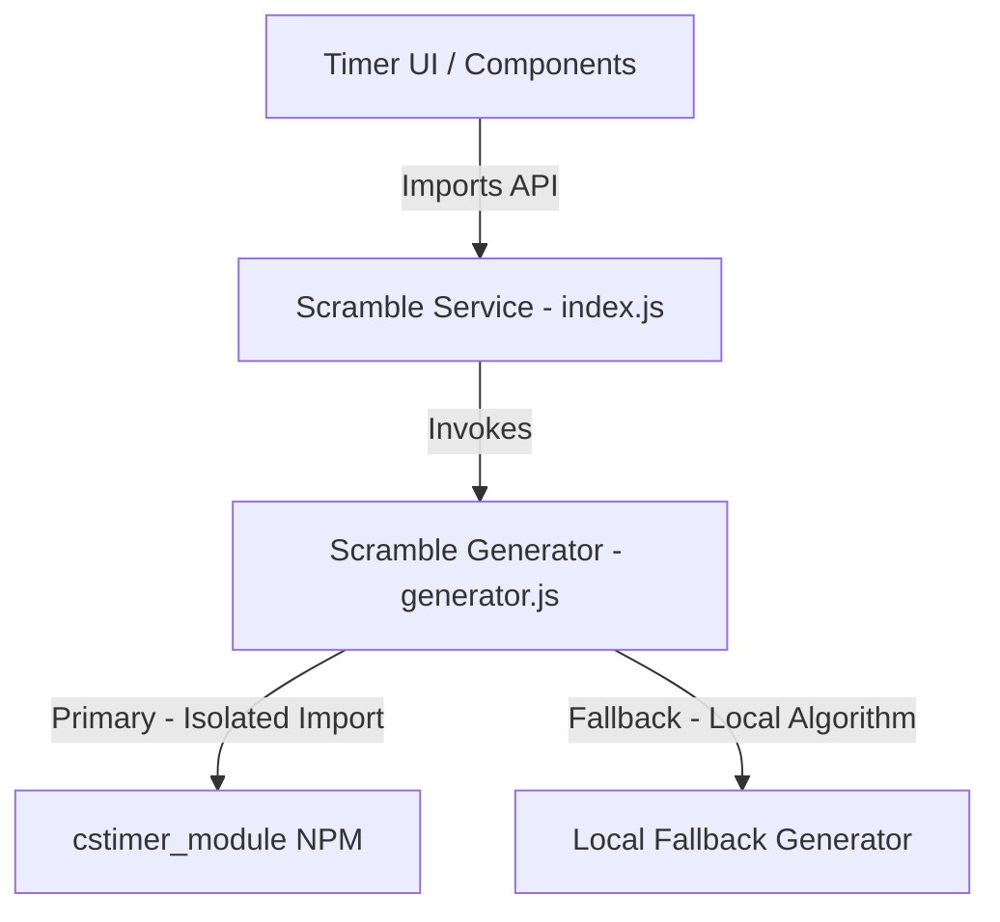

# Cubit Scramble Generator Service (Stage 1 Architecture)

This service isolates and abstracts all scramble generation logic for Cubit V1, establishing the single-source-of-truth foundation that future stages (Stage 2: Cube State Engine & Visualizer, Stage 3: Timer UI) will build on.

## Architecture & Design Decisions

The scramble generator service is designed to be **completely stateless** and **loosely coupled**. It knows nothing about:
- Solving history or user sessions.
- Timer state or UI rendering.
- Frontend libraries (like React, Zustand, etc.).

Instead, it functions as a pure utility that takes a puzzle type and returns a highly extensible, immutable-looking `ScrambleObject`.



### Abstraction & Encapsulation
To maintain strict dependency boundaries, **no component or service outside this folder is allowed to import or interact with `cstimer_module`**. This isolated wrapper pattern ensures that if we decide to replace csTimer in the future (e.g., migration to TNoodle or custom client-side modules):
1. Only `generator.js` and `constants.js` need to be modified.
2. The public interface (`generateScramble(puzzleType)`) and the returned `ScrambleObject` contract remain completely unchanged.
3. No breaking changes propagate to downstream consumers.

---

## File Structure

- **`index.js`**: The public-facing entrypoint of the service. Exposes normalized constants and the primary `generateScramble` API.
- **`generator.js`**: Core generation orchestration. Calls the third-party module and applies fallback safety measures.
- **`constants.js`**: Event-to-module mappings, supported puzzle types, and fallback move arrays.
- **`types.js`**: Holds JSDoc object typings and validation functions to verify schema compliance.
- **`utils.js`**: General-purpose utilities like RFC4122 v4 compliant UUID generation.
- **`scramble.test.js`**: Node-based automated test suite verifying correctness, schema verification, and fallback handling.

---

## Public API Contract

### `generateScramble(puzzleType)`

- **Arguments**: `puzzleType` (String) - Can be `'2x2'`, `'3x3'`, `'4x4'`, or `'5x5'`. Defaults to `'3x3'`.
- **Returns**: `ScrambleObject`

#### The `ScrambleObject` Contract
```javascript
{
  id: "e44c21df-6668-45fa-b6bb-35fa343058b7",      // UUID v4 for unique indexing
  puzzleType: "3x3",                              // Normalized puzzle type
  scramble: "R2 U' L2 F2 U L2 D F2 ...",           // Raw scramble moves
  timestamp: 1690623254000,                       // Generation epoch timestamp (ms)
  cubeState: null,                                // Reserved for Stage 2 Cube Engine
  visualization: null,                            // Reserved for Stage 2 SVG/Canvas Renderer
  metadata: {                                     // Extensible telemetry & logs
    generator: "cstimer_module",                  // Source of generation
    generatedAt: "2026-07-29T14:00:00.000Z"
  }
}
```

---

## Graceful Fallback Mechanics

The service has multiple fail-safes designed to keep the application resilient:
1. **Unsupported Puzzle Guard**: Requesting an unsupported puzzle type (e.g., `'6x6'`) falls back to `'3x3'` (default WCA puzzle), triggers a console warning, and fills `metadata.generator` with `'local_fallback_unsupported'`.
2. **Library Execution Failure**: If `cstimer_module` fails to generate a scramble or throws an error (due to module loading issues, script environment mismatch, etc.), a `try/catch` block intercepts the crash, logs a warning, and fires the **Smart Local Fallback Generator**.
3. **Smart Local Fallback Generator**: Generates random moves from `FALLBACK_MOVES` using valid base face directions (e.g., `U, R, F` for 2x2, `U, D, R, L, F, B` for 3x3). It guarantees valid-looking scrambles by preventing consecutive moves on the same face (e.g., `R R'`).

---

## Attribution & Legal

Cubit uses `cstimer_module` for WCA-compliant scramble generation. We express our gratitude to the authors of [csTimer](https://cstimer.net/) for open-sourcing the core scrambler routines.

> [!NOTE]
> Cubit relies on `cstimer_module` **exclusively** for raw scramble string generation. All cube state computations, WCA rule validations, visual cube rendering (flat SVG/Canvas or 3D WebGL), and solver states are implemented independently by Cubit.
> The abstraction layer exists purely to make this modular and allow replacing the string generator at any point without impacting other parts of the application.
