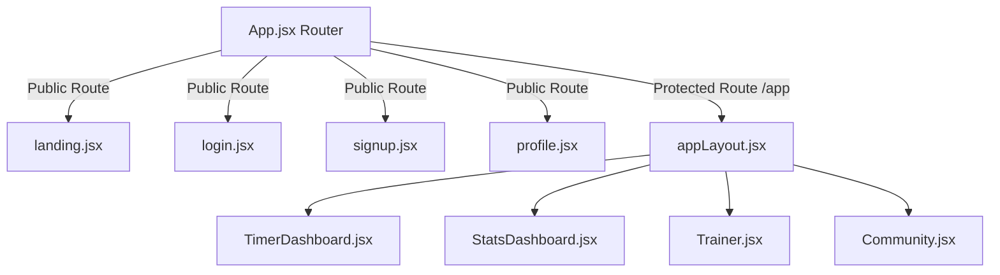

# Cubit Frontend Architecture

**Project:** Cubit  
**Version:** 1.0  
**Phase:** Frontend Audit & Documentation

This document describes the design, folder hierarchy, visual pages, and data flow of Cubit's React frontend application. It acts as the technical manual for understanding how the user interface is structured and how it interacts with local state before backend integration.

---

## 1. Tech Stack & Frontend Frameworks

The client is built as a single-page application (SPA) optimized for performance and aesthetics.

* **Core UI Runtime**: React 19
* **Build System & Dev Server**: Vite
* **Routing**: React Router DOM v6
* **Styling**: Modular vanilla CSS (located adjacent to the components or in specialized layout directories)
* **3D Visualizations**: Three.js, React Three Fiber (R3F), and `@react-three/drei` (used for the interactive Rubik's cube rendering)
* **Icons**: Lucide React
* **Charts**: Recharts (for analytics and statistics)

---

## 2. Directory Hierarchy

All frontend source files reside under the `client/src/` folder.

```plaintext
client/
├── public/                 # Static public assets (Favicons, web manifests)
└── src/
    ├── assets/             # Brand SVGs and static visual assets
    ├── components/
    │   ├── layout/         # Frame components (appLayout.jsx, nav.jsx, statsBar.jsx)
    │   ├── pages/          # Full page layouts loaded by React Router
    │   ├── stats/          # Specialized chart visualizations (Recharts wrapper)
    │   └── ui/             # Reusable UI widgets and interactive 3D files
    ├── mock/               # Mock data files representing API responses
    ├── utils/              # Client-side statistics math and format helpers
    ├── App.jsx             # React routing setup and layout mounting
    ├── App.css             # Root variables and application reset styles
    ├── index.css           # Global typography and base utility definitions
    └── main.jsx            # DOM entrypoint mapping
```

---

## 3. Application Routing & Layouts

Cubit's router (`client/src/App.jsx`) splits public user pages from private dashboard pages.



### Route Registry
1. `/`: Renders `Landing` — A landing screen explaining features.
2. `/login`: Renders `Login` — Login form (static simulation).
3. `/signup`: Renders `Signup` — Signup form (static simulation).
4. `/profile`: Renders `Profile` — A user profile details view.
5. `/app/*`: Renders the authenticated layout frame `AppLayout`, nesting the following child screens:
   * `/app` (index): `TimerDashboard`
   * `/app/stats`: `StatsDashboard`
   * `/app/trainer`: `Trainer`
   * `/app/trainer/lesson/:id`: `Lesson` (Static preview page)
   * `/app/community`: `Community`

---

## 4. Key UI Pages & Components

### Layout Components (`components/layout/`)
* **`appLayout.jsx`**: Arranges the sidebar navigation, the stats toolbar, and the main view panel using a CSS Grid layout.
* **`nav.jsx`**: Responsive vertical navigation sidebar. Handles collapsing/expanding and profile options popover.
* **`statsBar.jsx`**: Vertical toolbar docked to the right of the timer dashboard. It shows the current session solves list, with a scrollable record list and dynamic statistics calculations.

### Main Client Views (`components/pages/`)
* **`timerDashboard.jsx`**: The core practice area. Includes:
  * Static scramble text layout.
  * Interactive 3D Rubik's Cube renderer.
  * Timer digits block.
  * Options grids (puzzle selector, inspection timer, alerts).
* **`statsDashboard.jsx`**: Coordinates charts, tables, and KPIs, rendering:
  * Key Performance Indicators (PB, Average of 5, Average of 12, Session Mean).
  * Solve Trend chart (Area chart).
  * Time Distribution (Donut chart).
  * Best Time Progress (Line chart).
  * Recent Sessions grid.
* **`trainer.jsx`**: Dashboard displaying lesson cards grouped by difficulty levels.
* **`community.jsx`**: Social section containing feed posts, comment popups, friends list, and a leaderboard.
* **`profile.jsx`**: Standard user dashboard containing public details and tabbed lists for posts and friendships.

### 3D Interactive UI (`components/ui/`)
* **`InteractiveCube.jsx`**: Set up as a Canvas that loads a 3D model of a Rubik's Cube.
* **`Model.jsx`**: Loads the WebGL asset using `@react-three/drei` and maps orbital camera angles for interactive spinning.

---

## 5. Data Flow & Local State

In its current state, the frontend is a **static presentation shell** powered by local mock data.

* **API Services**: There are no active API modules, controllers, or network drivers (like Axios instances) wired up.
* **State Stores**: The client does not use a state container (such as Zustand, Redux, or React Context) to persist session state or handle authenticated session states.
* **Solves & Statistics Calculations**: 
  * The timer dashboard and the stats sidebar maintain their own ephemeral component states.
  * All statistical charts are loaded using a static data file (`src/mock/statsData.js`).
  * Basic KPI metrics in the stats sidebar are calculated client-side in real-time via `src/utils/statsHelpers.js` (e.g., calculating AO5, AO12, and Means from an array of solves).
* **Community Posts & Notifications**: Renders hardcoded arrays in `community.jsx` and does not synchronize likes, comments, or incoming requests.
