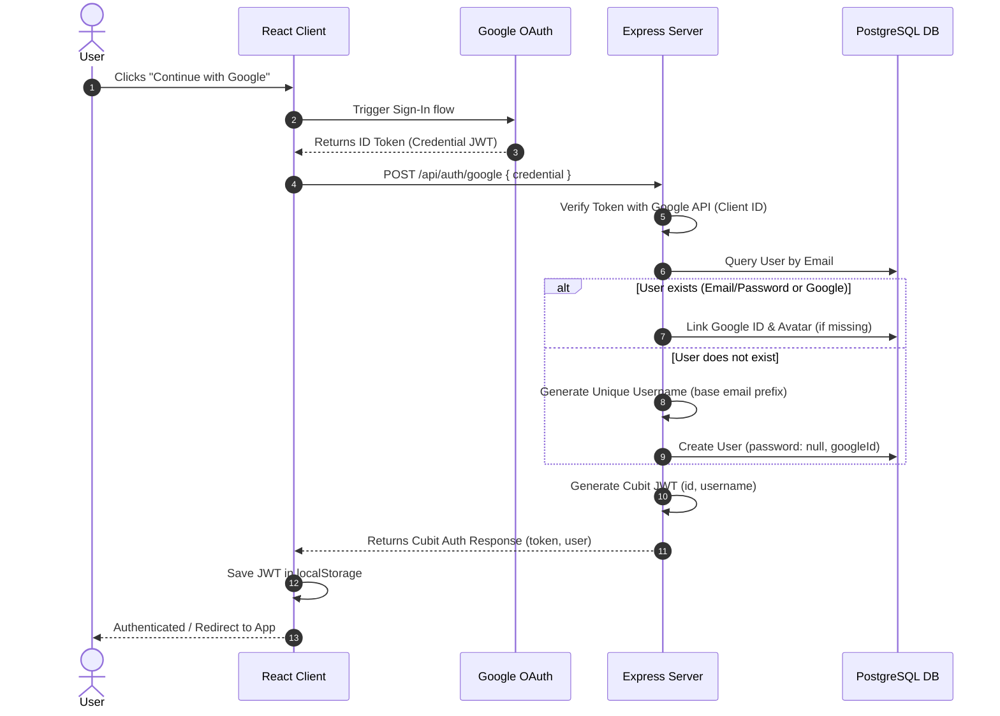

# Google Sign-In Integration Documentation

This document describes the architectural changes, endpoints, schema extensions, and user flow details for the Google Sign-In integration in Cubit.

---

## 1. Authentication Architecture

Google Sign-In has been integrated as an extension of the existing JWT authentication architecture. The existing Email/Password login flows and JWT validation schemas remain completely untouched.



---

## 2. API Endpoint Specification

### `POST /api/auth/google`

Authenticates a user via Google credentials. Matches the existing login response format.

* **Request Headers:**
  * `Content-Type: application/json`

* **Request Body:**
  ```json
  {
    "credential": "<google_id_token>"
  }
  ```

* **Success Response (200 OK):**
  ```json
  {
    "success": true,
    "message": "Login successful",
    "data": {
      "token": "eyJhbGciOiJIUzI1NiIsIn...",
      "user": {
        "id": "cl...",
        "email": "cuber@cubit.dev",
        "username": "cuber",
        "displayName": "Cuber Pro",
        "avatarUrl": "https://lh3.googleusercontent.com/...",
        "bio": null,
        "emailVerified": true,
        "createdAt": "2026-07-17T04:22:00.000Z",
        "updatedAt": "2026-07-17T04:22:00.000Z"
      }
    }
  }
  ```

* **Error Responses:**
  * `400 Bad Request`: Missing credential.
  * `401 Unauthorized`: Invalid Google credential signature or verification failure.

---

## 3. Database Schema Extensions

The Prisma `User` schema (`server/prisma/schema.prisma`) has been extended to support Google accounts:

```prisma
model User {
  id            String   @id @default(cuid())
  email         String   @unique
  username      String   @unique
  password      String?  // Made optional to support Google-only signups
  googleId      String?  @unique // Google sub identifier
  avatarUrl     String?  // Retained (already nullable)
  displayName   String
  emailVerified Boolean  @default(false)
  // ... other relations
}
```

---

## 4. Frontend Component Integration

The integration overlays the official Google Sign-In iframe transparently over the existing, custom-styled "Continue with Google" buttons on both the **Login** and **Signup** pages. This preserves the visual design perfectly without breaking the visual aesthetic of the UI.

### Client Wrapper
* The application is wrapped in `GoogleOAuthProvider` inside `client/src/main.jsx` using `import.meta.env.VITE_GOOGLE_CLIENT_ID`.

### Auth Buttons Overlay Structure
```jsx
<div className="auth-google-btn-container" style={{ position: 'relative', width: '100%' }}>
  <button type="button" className="auth-google-btn" id="login-google-btn" style={{ width: '100%' }}>
    <svg className="auth-google-icon" ... />
    Continue with Google
  </button>
  <div style={{
    position: 'absolute',
    top: 0,
    left: 0,
    width: '100%',
    height: '100%',
    opacity: 0,
    overflow: 'hidden',
    cursor: 'pointer'
  }}>
    <GoogleLogin
      onSuccess={handleGoogleSuccess}
      onError={handleGoogleFailure}
      useOneTap={false}
      width="100%"
      // ... customization props
    />
  </div>
</div>
```

---

## 5. Verification and Integration Tests

A self-contained integration test suite has been created in `server/test-auth.js` that tests:
* Normal signup, login, and token-based me-fetching.
* Google signup (creates new user).
* Google login (resolves existing email accounts to prevent duplicates).
* Auto-linking Google profile characteristics (Google ID, avatars) to existing accounts.

### Run Server-side Verification
To run the automated authentication tests suite:
```bash
cd server
node test-auth.js
```
