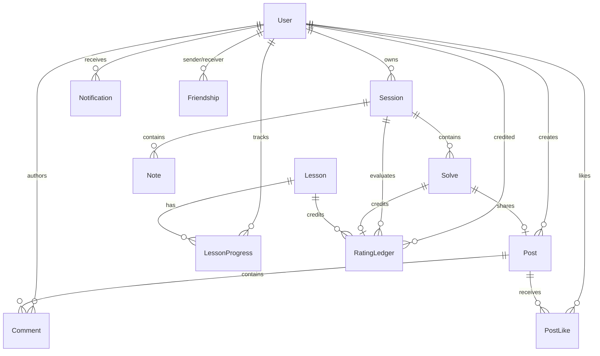
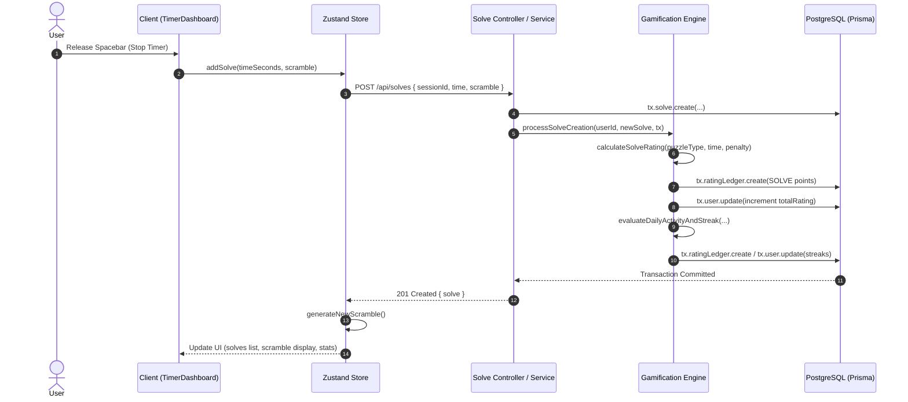

# Cubit — High-Level Design (HLD)

## 1. Purpose
This High-Level Design (HLD) document defines the architectural framework, system topology, component interactions, data boundaries, and technical decisions of the Cubit platform. It serves as an authoritative architectural reference for developers, technical reviewers, and automated system assessors.

---

## 2. System Overview
Cubit is structured as a client-server web application with decoupled execution responsibilities:
- **Frontend (Client)**: A Single Page Application (SPA) built with React 19, Vite, and Zustand for state management. Handles user interaction, real-time timing, 3D spatial cube state transformations, 2D unfolded net rendering, and focus audio playback.
- **Backend (Server)**: A RESTful and WebSocket server built with Express 5, Node.js, and Socket.io. Implements authentication, business logic, community interactions, real-time notifications, and authoritative gamification rating calculations.
- **Database**: A PostgreSQL relational database managed through Prisma ORM (v6.19) with a Neon serverless driver adapter (`@prisma/adapter-neon`). Serves as the single source of truth for persistent user data, session records, solve histories, and rating ledgers.
- **External Services**: Cloudinary for image media hosting, Google OAuth 2.0 for identity verification, and npm for distribution of the standalone `@06parnil/cubit.js` package.

---

## 3. Technology Stack

| Layer | Technology / Library | Version / Details | Architectural Role |
|---|---|---|---|
| **Client UI Framework** | React | `^19.2.6` | Component composition, virtual DOM rendering |
| **Client Build System** | Vite | `^8.0.12` | HMR development server & production bundler |
| **Client State Management** | Zustand | `^5.0.14` | Global state management for Auth, Sessions, Solves, Notes |
| **Client Routing** | React Router DOM | `^7.17.0` | Client-side SPA routing (`BrowserRouter`, `Routes`, `Route`) |
| **Client HTTP Client** | Axios | `^1.18.0` | Promise-based HTTP client with request/response interceptors |
| **Scramble Engine Library** | csTimer Module | `^0.1.5` | WCA scramble generation routines (`cstimer_module`) |
| **Icons & Visuals** | Lucide React / Recharts | `^1.18.0` / `^3.8.1` | UI icons and statistical analytics charting |
| **Server Framework** | Express | `^5.2.1` | HTTP server application framework |
| **Real-Time WebSockets** | Socket.io | `^4.8.3` | Bidirectional real-time notification push pipeline |
| **Database ORM** | Prisma | `^6.19.3` | Type-safe database client & schema migrations |
| **Database Engine** | PostgreSQL | Neon Serverless | Relational database storage |
| **Authentication** | JSON Web Tokens / Bcrypt | `jwt ^9.0.3` / `bcrypt ^6.0.0` | Statetess bearer authentication & password hashing |
| **OAuth Integration** | Google Auth Library | `^10.9.0` | Google ID Token verification on server |
| **Media Hosting** | Cloudinary / Multer | `cloudinary ^2.10.0` / `multer ^2.2.0` | Image upload stream processing & CDN storage |

---

## 4. Repository Architecture

```
Cubit-SourceCode/
├── client/                     # React Frontend Single Page Application
│   ├── src/
│   │   ├── components/        # UI components (layout, pages, scramble, stats, ui)
│   │   ├── services/          # Client services (api, store, focusStore, socket, cubeEngine, scramble)
│   │   ├── utils/             # Helper utilities (statsHelpers.js)
│   │   ├── App.jsx            # Top-level application router & socket lifecycle
│   │   └── main.jsx           # React application bootstrap
│   ├── package.json
│   └── vite.config.js
├── server/                     # Express Backend Server Application
│   ├── config/                # Database, Cloudinary, Logger, and Focus Tracks configuration
│   ├── controllers/           # HTTP request handlers for all endpoints
│   ├── middlewares/           # Auth JWT protection, Multer upload, and Error handling
│   ├── prisma/                # Prisma schema file and seed script
│   ├── routes/                # Express router definitions (`cubit.routes.js` master router)
│   ├── services/              # Business logic, Gamification Engine, Stats, Community, Friends
│   ├── utils/                 # Socket emitter utilities, pagination, response formatters
│   ├── app.js                 # Express application configuration & CORS setup
│   ├── server.js              # HTTP server & Socket.io initialization entry point
│   └── package.json
├── docs/                       # Project engineering documentation & blueprints
└── README.md
```

---

## 5. System Architecture Diagram

```mermaid
graph TD
    User([User Browser / Mobile])

    subgraph Client App ["Client Application (React + Vite)"]
        UI[React UI Components]
        Store[Zustand Stores (useStore, useFocusStore)]
        Engine[Cubit Cube Engine (3D Math + 2D Net Renderer)]
        ScrambleGen[Scramble Generator (csTimer + Fallback)]
        Audio[Native HTMLAudio Element]
    end

    subgraph Backend App ["Backend Application (Express 5)"]
        Server[Express Server (server.js / app.js)]
        MasterRouter[Master Router (/api)]
        AuthMiddleware[Auth Middleware (JWT Protect)]
        Controllers[Controller Layer]
        Services[Service Layer]
        Gamification[Authoritative Gamification Engine]
        SocketServer[Socket.io Real-Time Server]
    end

    subgraph DatabaseLayer ["Database Layer"]
        PrismaORM[Prisma ORM Client]
        PostgreSQL[(PostgreSQL - Neon Database)]
    end

    subgraph ExternalServices ["External Cloud Services"]
        Cloudinary[Cloudinary Media CDN]
        GoogleOAuth[Google OAuth 2.0 Identity Provider]
    end

    User --> UI
    UI <--> Store
    UI <--> Engine
    UI <--> ScrambleGen
    UI <--> Audio

    Store <-->|HTTP / Axios REST API| MasterRouter
    User <-->|WebSocket Connection| SocketServer

    MasterRouter --> AuthMiddleware
    AuthMiddleware --> Controllers
    Controllers --> Services
    Services --> Gamification
    Services <--> PrismaORM
    PrismaORM <--> PostgreSQL

    Services <--> Cloudinary
    Services <--> GoogleOAuth
    Services --> SocketServer
```

---

## 6. Frontend Architecture
The client architecture follows a unidirectional state and component flow:
- **Routing**: `App.jsx` handles public pages (`/`, `/login`, `/signup`, `/privacy`, `/terms`, `/cubitjs`), protected user profile pages (`/profile`, `/profile/:username`), and nested app routes (`/app/*` via `AppLayout`).
- **Layout System (`AppLayout.jsx`)**: Responsive 3-column desktop layout containing a conditional `StatsBar` (left column), dynamic main content area (`TimerDashboard`, `StatsDashboard`, `Trainer`, `Lesson`, `Community`), and navigation bar (`Nav`, right column).
- **State Management**:
  - `services/store.js`: Manages user auth state, active session, sessions inventory, solve history, active scramble object, and session notes.
  - `services/focusStore.js`: Manages ambient audio track catalog, track selection, play/pause state, volume, looping, seeking, and HTMLAudioElement event listeners.
- **Scramble & Cube Engine**: Pure JavaScript modules residing in `services/scramble/` and `services/cubeEngine/` decoupled from React hooks.

---

## 7. Backend Architecture
The backend follows a layered MVC/Service architecture:
1. **Server Layer (`server.js`)**: Configures process environment, initializes HTTP server, mounts Socket.io websocket listeners, connects database via `connectDB()`, and starts port listener.
2. **Express Setup (`app.js`)**: Applies CORS security headers with origin Set checking and Vercel domain regex matching, mounts `express.json()`, mounts `/api` routes via `cubit.routes.js`, and attaches global `errorHandler` middleware.
3. **Route Layer (`routes/`)**: Defines HTTP verb routes, attaches `authMiddleware` where authentication is required, and delegates request execution to controllers.
4. **Controller Layer (`controllers/`)**: Validates request parameters/body format and returns formatted JSON responses (`res.status().json()`) or passes errors to `next(error)`.
5. **Service Layer (`services/`)**: Executes core business logic, orchestrates Prisma database queries, invokes Cloudinary image uploads, and triggers gamification rating processing.

---

## 8. Database Architecture
Cubit utilizes PostgreSQL managed through Prisma ORM (`server/prisma/schema.prisma`).



---

## 9. Authentication Architecture
- **Password Auth**: Email & password registration with bcrypt salt rounds = 10 (`server/services/auth.service.js`).
- **Google OAuth 2.0**: ID token credential verified server-side using `google-auth-library` (`OAuth2Client.verifyIdToken`). Automatically creates user account with generated unique username if email does not exist.
- **JWT Issuance**: 7-day expiration JSON Web Token (`jwt.sign`) containing `{ id, username }`.
- **Token Verification**: Client attaches `Authorization: Bearer <token>` header via Axios interceptor (`client/src/services/api.js`). Backend `auth.middleware.js` verifies token via `jwt.verify` and attaches `req.user` to request.

---

## 10. Solve Lifecycle & Gamification Architecture



---

## 11. Security & Data Protection Boundaries
- **Authentication Protection**: Protected endpoints enforce `authMiddleware`.
- **Resource Ownership Verification**: All session, solve, note, profile update, post deletion, comment deletion, and friend management operations explicitly verify `resource.userId === req.user.id` or `resource.sessionId -> session.userId === req.user.id`.
- **Immutable Financial Ledger**: `RatingLedger` entries are immutable log rows. Point mutations (e.g., solve penalty updates or solve deletions) execute delta arithmetic and audit updates in atomic Prisma transactions.

---

## 12. Deployment Topology
- **Frontend Deployment**: Deployed on Vercel as a static Single Page Application with SPA route rewrites configured in `client/vercel.json`.
- **Backend Deployment**: Node.js process hosted on cloud application platform (e.g. Render/Vercel/Railway), communicating with Neon PostgreSQL database over secure TLS connection.
