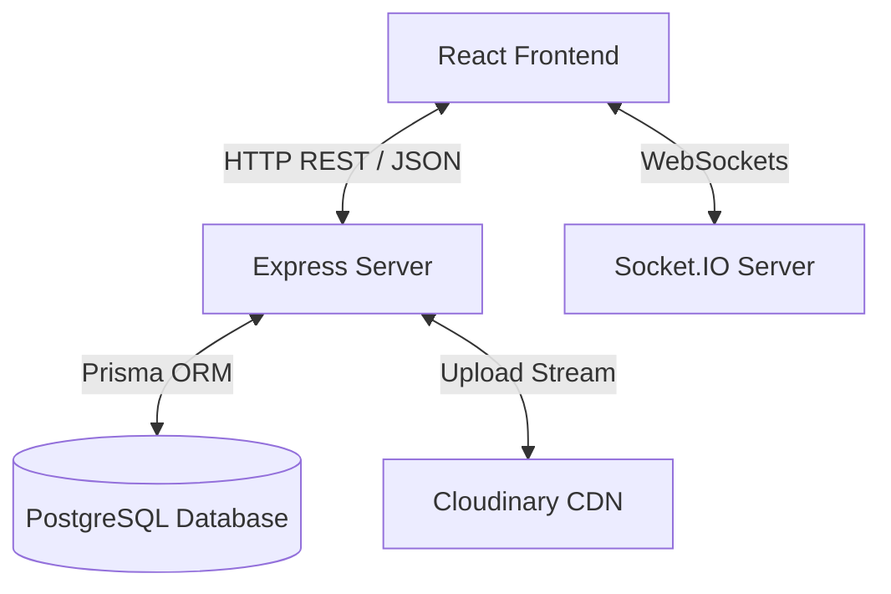

# Cubit Integration Audit & Implementation Roadmap

**Project:** Cubit  
**Phase:** Phase 4 — Frontend Integration  
**Status:** Verification Completed

This document serves as the definitive **Integration Roadmap** and source of truth for the Cubit codebase. It details the backend REST API specifications, database models, Socket.IO events, and the frontend React application structure. Crucially, it highlights the technical discrepancies between the frontend's mock implementation and the backend's production code, mapping out the precise data transformations and providing a step-by-step checklist for integration.

---

## 1. Architectural Overview & Contracts

Cubit follows a decoupling of concerns between a **Node.js/Express/Prisma/PostgreSQL** backend and a **React/Vite** frontend.

### Core Stack
* **Backend**: Express.js, Prisma (ORMs), PostgreSQL (Database), Cloudinary (Image storage), Socket.IO (Real-time events).
* **Frontend**: React 19, Vite, Recharts (Charts), React Router (Routing), Three.js/Fiber (3D Renderers), Axios & TanStack React Query (API clients).



---

## 2. Backend Services & Database Contracts

The database is built on normalized relations, keeping computed statistics out of storage.

### Core Prisma Models & Constraints
1. **User**: Stores unique `email` and `username`, password hash, `displayName`, `avatarUrl`, and profile `bio`.
2. **Session**: Represents a practice session. A user has `1:N` sessions. Only **one** session can have `isActive = true` per user at a time.
3. **Solve**: Represents an individual solve belonging to a session (`1:N`). Stores the `time` in integer milliseconds, `scramble` text, and a `penalty` (`NONE`, `PLUS_TWO`, `DNF`).
4. **Lesson**: Holds learning tutorials with a unique `slug`, `title`, `description`, difficulty, and category.
5. **LessonProgress**: A junction table mapping `User` to `Lesson` with fields `completed` (Boolean) and `completedAt`.
6. **Post**: Represents a community feed item with `type` (`DISCUSSION`, `TIP`, `QUESTION`, `PB_SHARE`, `SOLVE_SHARE`), `content`, and optional `imageUrl` or `solveId`.
7. **Comment**: Represents post replies.
8. **Friendship**: Manages self-relations between users (`senderId`, `receiverId`) with statuses: `PENDING`, `ACCEPTED`, `REJECTED`, `BLOCKED`.
9. **Notification**: Stores database-backed notifications with types (`FRIEND_REQUEST`, `FRIEND_ACCEPTED`, `POST_LIKE`, `COMMENT`).

### Socket.IO Channels & Auth
* **Handshake Authentication**: The socket connection expects a JWT token passed in the handshake auth (`socket.handshake.auth.token`) or query param. It verifies the token and attaches the decoded user object to `socket.user`.
* **Personal Room**: On connection, each socket joins a private room named:
  ```text
  room:${userId}
  ```
* **Real-time Notifications**: Real-time notifications are pushed via the backend server-side utility `emitToUser(userId, event, payload)` using the private user room.

### Cloudinary Integration
* Profile avatar uploads and community post attachments are streamed directly from memory buffers to the Cloudinary folders `Cubit/avatars` and `Cubit/posts` using a stream utility (`streamifier`), returning public secure URLs to save in the database.

---

## 3. Frontend Architecture & Visual State

The frontend is structured to keep UI components separated from routing logic.

### Directory Structure
```plaintext
client/src/
├── components/
│   ├── layout/       # Layout frames (appLayout, nav, statsBar)
│   ├── pages/        # Main route views (landing, dashboard, community, profile)
│   ├── stats/        # Recharts wrappers (DistributionChart, SolveTrendChart)
│   └── ui/           # 3D interactive elements (InteractiveCube, Model)
├── utils/            # Client side calculation helpers (statsHelpers)
├── mock/             # Dummy data lists (statsData)
├── App.jsx           # Master route registry
└── main.jsx          # Mount entrypoint
```

### Route Mappings (`App.jsx` & `AppLayout.jsx`)
* `/` -> `Landing` (Public landing screen)
* `/login` -> `Login` (Static form, redirects to `/profile` on submit)
* `/signup` -> `Signup` (Static form, redirects to `/profile` on submit)
* `/profile` -> `Profile` (Static profile dashboard)
* `/app/*` -> `AppLayout` (Main authenticated layout)
  * `/app/` (index) -> `TimerDashboard` (Static timer display and features panel)
  * `/app/stats` -> `StatsDashboard` (Client-side calculated charts utilizing mock lists)
  * `/app/trainer` -> `Trainer` (Static lesson overview grid)
  * `/app/trainer/lesson/:id` -> `Lesson` (Static placeholder for lesson)
  * `/app/community` -> `Community` (Feed, notifications popover, static leaderboard)

---

## 4. Data Translation & Mapping Guide

Several key mismatches exist between the frontend's mock data model and the backend API design. These must be resolved during integration.

### Mismatches & Data Translation Guide

| Feature / UI Component | Frontend Expectation (Mock) | Backend Representation (API/DB) | Required Integration Translation |
| :--- | :--- | :--- | :--- |
| **Solve Times** | Floats in seconds (e.g., `11.43`, `8.65`) | Integers in milliseconds (e.g., `11430`, `8650`) | **Division/Multiplication**: Convert milliseconds from backend by dividing by `1000` for the UI. Multiply seconds entered by `1000` before saving. |
| **Solve Trend Chart** | Array of `{ session: "S1", ao5, ao12, mean, pb }` | Array of `{ sessionId, sessionName, pb, mean, ao5, ao12 }` | **Label Mapper**: Map `sessionName` or generate indexed labels (e.g., `S1`, `S2`) to feed the chart X-axis `dataKey="session"`. |
| **Time Distribution Chart** | Array of `{ name: "<6s", value: 12 }` | Array of `{ range: "<6s", count: 12 }` | **Field Rename**: Re-map `range` -> `name` and `count` -> `value` before feeding the Recharts Pie dataset. |
| **Best Time Progress Chart** | Array of `{ date: "MM/DD/YYYY", bestTime: 5.85 }` | Array of `{ sessionId, sessionName, bestTime: 5850 }` | **Scale & X-Axis**: Divide `bestTime` by `1000` to convert to seconds. Set chart `XAxis dataKey="sessionName"` instead of `date`. |
| **Recent Sessions Table** | Expects detailed columns: `Best Time`, `AO5`, `AO12`, `Mean`, `Date` | Returns basic summary: `sessionId`, `sessionName`, `puzzleType`, `solveCount`, `best`, `average` | **Compute or Omit**: Calculate `ao5` and `ao12` client-side from the solves, or display dashes for values not returned in the dashboard payload. |
| **Edit Profile Fields** | Form edits Profile Pic URL (Text input), Email, and Default Puzzle | Accepts `displayName`, `bio` on `PATCH /`. Avatar requires file upload on `POST /avatar` | **Forms Refactor**: Use Multipart Form for avatar updates. Remove Email and Default Puzzle fields from the profile modal (since they are not supported in the profile table). |
| **Social / Relationships** | Assumes Follower/Following architecture with modals | Mutual Friendship status: `ACCEPTED`, `PENDING`, `REJECTED`, `BLOCKED` | **Status check**: Map followers count to `totalFriends`. Replace Follow/Unfollow UI with Send Friend Request and Accept/Remove Friend flows. |
| **Community Feed Tags** | Filters: `All`, `Tips`, `Random`, `Discussions`, `News`, `Solves` | Enums: `DISCUSSION`, `TIP`, `QUESTION`, `PB_SHARE`, `SOLVE_SHARE` | **Tag Mapper**: Translate UI category selections to backend enums (e.g., `Discussions` -> `DISCUSSION`, `Tips` -> `TIP`, `Solves` -> `PB_SHARE` or `SOLVE_SHARE`). |
| **Leaderboard Component** | Renders static users (John Doe, Speed Master, etc.) | **No backend endpoint** exists for leaderboards in V1 | **Fallback**: Keep static mock users in place or plan a leaderboard API extension for the next phase. |
| **Lesson Pages** | Route: `/app/trainer/lesson/:id` (e.g., numerical id `1`) | API: `/lessons/:slug` (expects URL-friendly slug string) | **Slug Routing**: Modify the trainer routes and navigation to use slug strings instead of numeric IDs. |
| **MDX Lesson Rendering** | Static HTML page displaying "Lesson {id} Placeholder" | Returns MDX document strings from database | **Markdown Parser**: Integrate a markdown/MDX renderer (e.g. `react-markdown`) to parse dynamic lesson content. |

---

## 5. Step-by-Step Integration Checklist

Use this checklist to perform a clean integration without breaking existing layout aesthetics.

### Phase 1: Authentication & Client Setup
- [ ] Install API client helper: Create `client/src/services/api.js` utilizing `axios`.
- [ ] Implement interceptors to automatically attach JWT token (`Authorization: Bearer <token>`) from `localStorage` to all request headers.
- [ ] Connect `client/src/components/pages/login.jsx` and `signup.jsx` to `/api/auth/login` and `/api/auth/register`. Save the returned token in `localStorage`.
- [ ] Load current user details via `/api/auth/me` on app boot and store them in a React Context state or Zustand store to determine authenticated route access.

### Phase 2: Session & Solve Integration (Timer)
- [ ] Replace static `timerDashboard.jsx` timer digits and scramble with active values.
- [ ] Add event listeners to the Space key in `timerDashboard.jsx` to start/stop the timer and calculate elapsed time.
- [ ] When a solve finishes, send `POST /api/solves` with `sessionId`, solve time in milliseconds, and the scramble string.
- [ ] Integrate the sidebar `statsBar.jsx` to list solves from the active session (`GET /api/sessions/current`).
- [ ] Implement the `+2` and `DNF` actions in `statsBar.jsx` solves list (which trigger `PATCH /api/solves/:id`).

### Phase 3: Statistics Dashboard Integration
- [ ] Connect `statsDashboard.jsx` to fetch the unified dashboard payload (`GET /api/stats/dashboard`).
- [ ] Map the KPIs (`pb`, `ao5`, `ao12`, `mean`, `totalSolves`) dividing by `1000` to show decimal seconds.
- [ ] Map `solveTrend` array to the Recharts Area dataset, configuring the X-axis key to `sessionName`.
- [ ] Map `timeDistribution` array, converting the keys (`range` -> `name` and `count` -> `value`) to load the donut chart.
- [ ] Map `bestProgress` to the Line chart.
- [ ] Render the `recentSessions` table, displaying the best and average times formatted as seconds.

### Phase 4: Social Feed & Community Integration
- [ ] Connect `community.jsx` to load posts via `GET /api/community/posts?feed=global`.
- [ ] Implement like toggles calling `POST /posts/:id/like` and `DELETE /posts/:id/like`.
- [ ] Connect comments section to load comments and submit replies via `POST /posts/:id/comments`.
- [ ] Replace the mock followers modals with friends list (`GET /api/friends`) and request panels (`GET /api/friends/requests`).
- [ ] Wire up real-time notifications by connecting to the Socket.IO server on connection and listening for custom notification events (rendering them in the nav bell panel).

### Phase 5: Trainer & Lessons Integration
- [ ] Replace hardcoded lessons in `trainer.jsx` by retrieving published items from `GET /api/trainer/lessons`.
- [ ] Update start buttons to route using `lesson.slug` instead of numerical index numbers.
- [ ] In `lesson.jsx`, retrieve the lesson content from `GET /api/trainer/lessons/:slug`.
- [ ] Install a markdown/MDX parser to dynamically render the lesson's rich details.
- [ ] Connect a "Mark Completed" button to trigger `POST /lessons/:slug/complete` to save completion progress.

---

## 6. Verification and freeze summary

The backend implementation is stable, schemas are properly defined, and controllers correctly parse input to return standardized JSON bodies. 

* All database schemas matches constraints.
* Folder layout matches the revised structure.
* Real-time notifications and socket logic are fully implemented.
* The API contract defined in `APIBlueprint.md` matches the code routes.

No application logic or client views were modified during this audit phase, maintaining the engineering freeze status.
